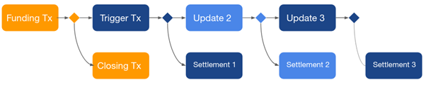
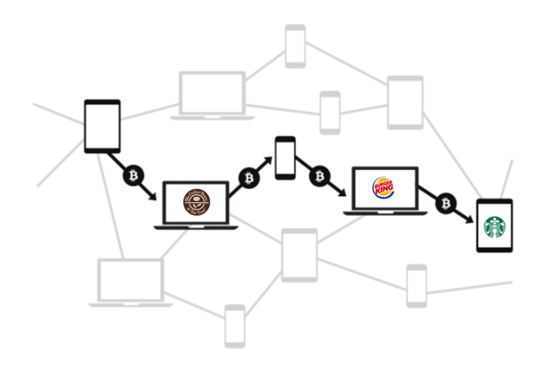
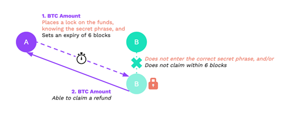
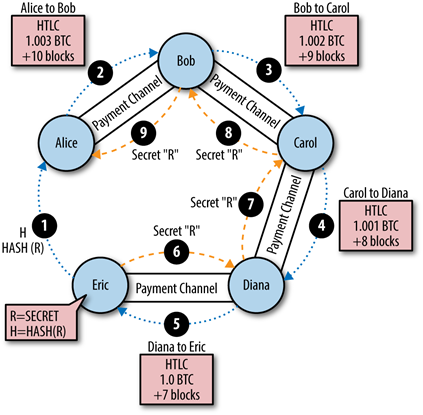

# Flash Layer

## The Problem

The blockchain has a scalability issue. On the one hand, for security and stability, you want as many nodes as possible in the network. On the other hand, reaching a network-wide consensus requires every update on the blockchain to be broadcasted to every node. This is a serious challenge to reaching credit card transaction throughput levels that can reach tens of thousands per second.

The main problem with scaling blockchain is the fact that every transaction is public and must be validated by all network nodes. But there is a way around that.

## The Solution

The solution to the blockchain scalability challenge is to not make every transaction public. Frequently in business, two parties will do multiple transactions between them before they need to terminate that piece of business. Being able to take a multitude of transactions “off-chain” and onto layer 2 is a way to dramatically improve the transaction speed and therefore scalability of the blockchain. And that is precisely how Bosagora addresses the scalability issue.

Bosagora uses *payment channels* which enable two parties to carry out everyday transactions between them without requiring approval from the blockchain. Then they only do net settlement of all their transactions on-chain when needed.

Payment channels use a  second-layer payment protocol built on top of the Bosagora network. They are opened with an on-chain transaction and remain open until one or both parties decide to close the channel. While the channel is open, all communication happens only between the two parties.

At any point, either party has the means to close the channel with the most recent balance they mutually agreed on. In case of a dispute, the network is used as an arbiter to resolve the dispute. Payment channels only allow payments between two parties.

The benefits of these payment channels include the following:

+ Users do not need to open channels to every merchant individually
+ Fees are significantly smaller than on-chain fees
+ Payments are almost instantaneous. No waiting time for block confirmations.
+ Scales to millions of users, and near-infinite transactions/second

The idea of payment channels led to the Bosagora *Flash Layer*.

## Flash Layer

The Bosagora Flash Layer implements an improved version of Eltoo channels. [Eltoo]( https://bitcoinops.org/en/topics/eltoo/) is an update and settlement layer for second-layer payment channels like that used on Bosagora. The following sections explain how the Flash Layer works

### Opening a Channel

Channels are opened by the peer that provides the initial funds. This peer is referred to as the *funding peer*. Channels are marked as open with an on-chain transaction called the *funding transaction*. With funding transactions, the funds are locked with a multi-sig. The funds can only be consumed in a manner that both peers mutually agree on and provide the signatures for.

The steps are as follows:

1. The funding peer first creates the funding transaction and proposes opening a new channel to its peer, because publishing the funding transaction without any communication with the peer may result in losing the allocated funds forever.
2. The peer either rejects the channel according to its own configuration or accepts it, which triggers a set of additional steps before the channel is actually opened.
3. Before the funding peer can publish the funding transaction, two off-chain transactions are created and the peers exchange their signatures for them. These transactions are called *trigger* and *settlement*. They give both parties the means to close the channel at any point. The trigger transaction is an off-chain transaction that spends the funds from the funding transaction. If published to the blockchain, it begins a *non-collaborative channel close*.
4. Once the funding peer collects the required signatures for trigger and settlement transactions, it publishes the funding transaction to the Bosagora network.
5. Both peers continuously monitor the blockchain for externalization of the funding transaction. Externalization of the funding transaction marks the opening of the channel on the blockchain and the Flash nodes start accepting payments on the newly opened channel after that.

Since the funding transaction is no different than any other transaction, no nodes other than the parties involved are aware of the new channel. Similar to layer-1, the Flash Layer utilizes a *gossip protocol* to ensure the optimal operation of the network. Nodes gossip the necessary information about the newly opened channel to their known network peers.

### Payments

*Payments* are the exchange of off-chain transactions that happen between the channel peers. Payments update the *channel balance*, which is the distribution of funds between parties. Each payment creates an *update* and a *settlement transaction* pair.

*Update transactions* attach to the trigger transaction or to a previous update transaction. These update transactions are only published to the blockchain in case of an uncollaborative channel close.

*Settlement transactions* may only attach to exactly the previous trigger or update transaction.  Settlement transactions contain the current balance distribution between the channel parties. Settlement transactions cannot be externalized until their relative time lock expires. Once they are externalized, that marks the close of the channel. See the figure below for a visual depiction of a representative transaction.

### Sequence IDs

In other layer-2 implementations like Lightning Network of Bitcoin, if one of the parties tries to cheat and close the channel with an outdated balance, the other peer has the right to penalize them and get all the funds in the channel. Bosagora solves this using an improved Eltoo implementation with sequence IDs. Each trigger and update transaction has a locked script like the one below.

OP.IF

    <update-tx-key> <min-sequence-id> OP.VERIFY_SEQ_SIG
OP.ELSE

    <relative-timelock> OP.VERIFY_UNLOCK_AGE
    <settlement-tx-key> <sequence-id> OP.VERIFY_SEQ_SIG

OP.ENDIF

The IF branch ensures that only an update transaction with a newer sequence id can consume the given trigger/update transaction, without any timelock. The ELSE branch allows the corresponding settlement transaction to consume the trigger/update transaction after the timelock expires. With each update/trigger transaction, a new timelock starts, allowing the other party to override it with a newer update transaction if they have one.

This scheme ensures that nodes have enough time to overrule any non-collaborative channel close attempt with a newer update transaction. In the current version of the Bosagora Flash Layer, timelocks are set for 16 blocks, which on average gives a little less than 3 hours of time for nodes to react to a non-collaborative channel close.

### Closing a channel

Similar to opening a channel, closing a channel requires on-chain transactions. The ideal way to close a channel is the *collaborative channel close*. This requires both parties to be online and agree on a closing balance. In this case, the peers create a *closing transaction* that spends the funding transaction without any trigger/update/settlement transactions in between. This enables instantly closing the channel without waiting on any timelocks and with minimal on-chain fees.

A *Closing transaction* is an on-chain transaction that spends the funding transaction and pays peers their share of the initial funds. Once externalized, it marks the closing of the channel.

In situations where a peer is unresponsive or the peers can’t agree on a closing balance, a *non-collaborative channel close* is initiated by one of the peers by publishing the trigger transaction. Externalization of the trigger transaction starts the countdown on a timelock. During the timelock, nodes can publish newer update transactions, if they have any. After the timelock expires, the corresponding settlement transaction is published and externalization of that marks the channel as closed.

### Multi-hop payments

The Bosagora Flash Layer allows *multi-hop payments*. The Flash Layer finds a payment route to the merchant through a series of existing channels as shown in the graphic below. The payment is then routed through the channels. This eliminates the need to open a channel between each flash node.

Multihop payments require the following six steps:

1. Pathfinding
2. Onion encryption
3. Path probing
4. Channel updates
5. Invoices
6. Trustless payment forwarding

All six steps are discussed in detail below.

#### Path finding

The first step in supporting multi-hop payments is finding a series of channels that can route the required amount from payer to payee. The Gossip protocol in the Flash Layer tries to make sure that all nodes are aware of all open channels in the network. Using a graph of all the open channels, the originating node tries to minimize the total fees along the path while making sure that channels have enough capacity to forward the amount that it is trying to route. The pathfinding algorithm also allocates fees to each node on the path for the liquidity they provide.

#### Onion encryption

For privacy, all communications for multi-hop payments are *onion encrypted*, meaning that the packet is encrypted multiple times at the originating node. Each intermediate node decrypts it partially and forwards the packet to the next node by using the information revealed to it. In this manner, no unnecessary information is revealed to any nodes in between, providing the maximum amount of privacy for all parties.

In the case of an error, an error message is propagated back to the originating node. But this time, since no nodes have the full path back to the origin, the packet is obfuscated, instead of encrypted, in a way that only the originating node can de-obfuscate it. The privacy of the parties is protected even in an error state.

#### Path probing

Since paths can fail to forward the payment, there must be a way to retry a different path in such a circumstance. The Flash Layer, and the channels in the layer, are highly dynamic, so there could be multiple reasons why a payment fails. When an error occurs, the erroring node sends a message back to the originating node indicating why it failed. Using this information, the originating node either decides to retry with a different path or marks the payment as a failure and gives up.

#### Channel updates

Some public properties of the channels can be updated throughout the channel’s lifetime with a *channel update message* gossiped to the Flash Layer. Update messages carry critical information for pathfinding such as the most recent fee rate that the channel has.

#### Invoices

An *invoice* represents a payment between two nodes and is used to keep track of the payments. Invoices are generated by the payee and sent to the payer through some medium (QR codes, NFC, etc.) outside of the Flash Layer.

#### Trustless payment forwarding

For multi-hop payments to work in a decentralized system, there must be a way to forward the payment in a trustless way. In the Flash Layer, this is made possible with the use of *Hashed Timelock Contracts* (HTLC). HTLCs allow for a payment to be redeemed only if a secret is revealed, otherwise, the payment is revoked at the end of a timelock.

In the example above, Party A generates a random secret and creates an HTLC with a timelock of 6 blocks and the hash of the newly generated secret. If Party A reveals the secret to Party B, Party B can redeem the funds using that secret or Party A can get back the funds after the timelock of 6 blocks expires. This 9-step sequence is depicted in the graphic below:

(1) The payee generates a secret and passes the hash of the secret to the payee in the invoice.
(2 – 5) Using that hash, HTLCs are created at each hop of the path, locking the funds in each channel until a timeout expires. Once the chain of HTLCs reaches the payee, it has to reveal the random secret to the previous node to be able to get the payment.
(6 – 9) This creates a chain reaction of the secret being revealed to each node on the path until it reaches the originating node as a confirmation of a successful payment.

Once all HTLCs are resolved, intermediate nodes are left with a small profit they made off their fee. If for some reason, a payee never reveals the secret, all HTLCs on the path expire, one by one, starting from the node furthest away from the originating node and all nodes receive their funds back.

Multi-hop payments enable the Flash Layer to scale to near-infinite, low fee and almost instantaneous transactions per second trustlessly, while also providing incentive for parties to operate a Flash node and provide liquidity to the network.
